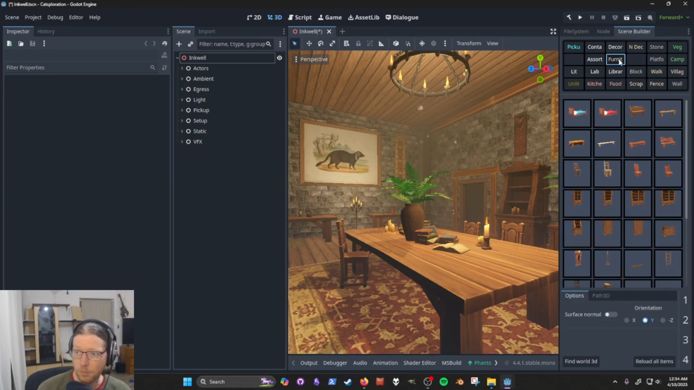
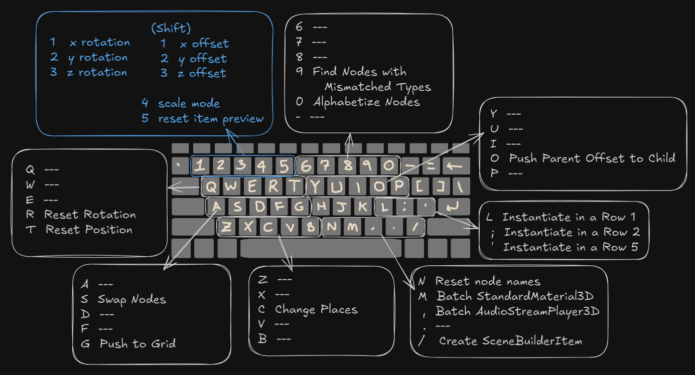

# Scene Build & Productivity Commands for Godot 4.4+

Scene Builder is a 3D level design tool and asset browser for  [Godot 4.4+](https://godotengine.org/), together with a set of common productivity commands.

The latest version can be [downloaded here](https://github.com/sci-comp/scene-builder/archive/refs/heads/main.zip) on GitHub, but you may also find release versions on [Itch.io](https://sci-comp.itch.io/scene-builder) or in the [Godot Asset Library](https://godotengine.org/asset-library/asset/2881).

> [!IMPORTANT]
Since I use this tool for my own games, any form of collaboration, bug reports, or new feature suggestions are greatly appreciated. Please join us in Discord, or make a post in Github's Issue's section if you would like to help out.

  

## Documentation

- [Quick Start Video Guide](#quick-start-video-guide)
- [Scope](#scope)
	- [Compatibility](#compatibility)
	- [Multi-Mesh Instances](#multi-mesh-instances)
	- [Grid Snapping](#grid-snapping)
- [Installation](#installation)
- [Shortcuts](#shortcuts)
	- [The Alt Key](#the-alt-key)
- [The Scene Builder Dock](#the-scene-builder-dock)
	- [Setting Up The Dock](#setting-up-the-dock)
	- [Scene Builder Items](#scene-builder-items)
	- [Updating the Scene Builder Dock](#updating-the-scene-builder-dock)
		- [Find World3D](#find-world3d)
		- [Reload All Items](#reload-all-items)
	- [Placement Mode](#placement-mode)
		- [Use Surface Normal](#use-surface-normal)
		- [Rotation Mode](#rotation-mode)
		- [Scale Mode](#scale-mode)
- [Contributors](#contributors)
- [License](#license)

## Quick Start Video Guide

### Scope

Scene builder is made to serve as a scene browser and scene placer for scenes of type Node3D. Scene builder also aims to offer a handful of productivity commands. Scenes may only be placed on collision shapes.

#### Compatibility

Scene builder should work with any type of collider, such those generated by [CSG Tools](https://docs.godotengine.org/en/3.5/tutorials/3d/csg_tools.html) or [Terrain3D](https://github.com/TokisanGames/Terrain3D)-- just make sure that the colliders have been generated during editor time.

#### Multi-Mesh Instances

Scattering large numbers of objects, often with help from multi-mesh instances, is currently out of scope. Please see one of the specialized tools below,

- [Terrain3D](https://github.com/TokisanGames/Terrain3D) has its own built-in pipelines for vegetation and instanced objects, and a new particle grass feature as well.
- [Scatter](https://github.com/HungryProton/scatter) is a powerful tool designed to randomly fill areas with props or other scenes.
- [Simple Grass Textured](https://github.com/IcterusGames/SimpleGrassTextured) is the perfect tool for painting 2d textures over a collision area.
- [Spatial Gardener](https://github.com/dreadpon/godot_spatial_gardener) is an efficient tool that uses an octree to scatter plants or props over arbitrary (possibly large) surfaces. 

#### Grid Snapping

Grid snapping is currently out of scope due to the existence of [GridMap](https://docs.godotengine.org/en/stable/tutorials/3d/using_gridmaps.html). GridMap is a fantastic tool built directly into Godot.

(Edit: actually, this might be worth considering?)

---

## Installation

In addition to being available in the AssetLib, Scene builder may be installed by simply cloning the entire repo into,

`res://addons/scene_builder/`

which means that a recursive directory pattern will exist,

`res://addons/scene_builder/addons/scene_builder/`

> [!NOTE]
Implementation details: Scene builder is logically divided into two main parts: scene builder commands and the scene builder dock. The script `scene_builder_commands.gd` adds commands to the Godot toolbar (Project > Tools) and listens for keyboard shortcuts. Each command's implementation is contained within the command's respective GDScript file, located in `addons/scene_builder/Commands/`. In the other hand, we have `scene_builder_dock.gd`, which handles logic for the interactable scene builder dock.

---

## Shortcuts

With an item selected in the dock,

- Enter x rotation mode: 1
- Enter y rotation mode: 2
- Enter z rotation mode: 3
- Enter x offset mode: Shift + 1
- Enter y offset mode: Shift + 2
- Enter z offset mode: Shift + 3
- Enter scale mode: 4
- Reset orientation: 5
- Select previous/next items by pressing: Shift + Left/Right Arrow
- Select previous/next category by pressing: Alt + Left/Right Arrow
- Exit placement mode: Escape

### The Alt Key

SceneBuilder commands all require the Alt key pressed for activation. Although Godot generally doesn't make use of the Alt key, it does conflict in a few cases. To keep things simple, I simply move Godot's shortcut somewhere else. Shortcuts are still in progress-- new commands are still being added.

To update default shortcuts, edit the resource `scene_builder_config.tres`, then reload the project.

> [!CAUTION]
Some default shortcuts for scene builder will likely conflict with Godot's default shortcuts. Scene builder's shortcuts may be updated by changing the values in the resource file: `addons/scene_builder/scene_builder_config.tres`, then reloading the project. Godot's shortcuts can be updated in the toolbar, `Editor > Editor Settings... > Shortcuts`.

We can also access commands from the menu, as is shown here,

## The Scene Builder Dock

### Setting Up The Dock

By default, our data directory is located here: `res://Data/SceneBuilderCollections/`. You may change this in the configuration file.

1. Enter your desired collection names into the CollectionNames resource. Empty folders with matching names will be created, if they do not already exist.

The dock is populated from SceneBuilderItem resources located in these folders.

If you have a folder in `res://Data/SceneBuilderCollections/` that is not listed in the CollectionNames resource, then it will simply be ignored. Conversely, if a collection name is written in CollectionNames, then a harmless error will occur if a matching folder is not found.

The scene builder dock only provides space for 18 collections, however, you can make additional folders. We can update which 18 collections are currently in use by swapping out names in the CollectionNames resource, then hitting the "Reload all items" button on the scene builder dock.

We can enable the plugin now to preview collection names in the dock. Since our collection folders are empty, you will see a harmless error: `Directory exists, but contains no items: Furniture`.

### Scene Builder Items

To create an item resource,

1. Select one or more paths in FileSystem that contain an imported scene with a root node that derives from type Node3D.
2. Run the "Create scene builder items" command by going to Project > Tools > Scene Builder > Create scene builder items, or by pressing the keyboard shortcut `Alt + /`
3. Fill out the fields in the popup window, then hit okay.
4. After pressing okay, the `icon_studio` scene will be opened. Please close the scene when it's done without saving changes to icon_studio.tscn. However, if you would like to make changes to icon_studio.tscn, then that's a great way to customize your icons.
5. In the scene builder dock, click the button "Reload all items"

### Update the Scene Builder Dock

#### Find World3D

The scene builder dock needs to know which scene it should be placing items into. Since this is typically done automatically, this button is usually not needed.

#### Reload All Items

Whenever we make changes to SceneBuilderItem resources or collection names, we must then press the "Reload all items" button on the scene builder dock.

### Placement Mode

When an icon is highlighted green in the scene builder dock, then placement mode has been enabled.

To exit placement mode, we may click the highlighted icon or press the escape key.

When placement mode is active, an item preview is created in the current edited scene. The preview node will have a parent node named "SceneBuilderTemp." We may safely delete this node when we are done, while the item preview node will be automatically clear when exiting placement mode.

#### Use Surface Normal

Instantiated items will align their Y axis with the specified orientation when the checkbox "Surface normal" is toggled on.

Due to gimbal lock, you may notice that the preview item will often acquire orientations with undesired offsets. Press `5` to reset the item preview's orientation.

#### Rotation Mode

Press `1`, `2`, or, `3` to enter rotation mode, where these digits represents the x, y, and z-axis respectively. When rotation mode is enabled, the corresponding digit will be highlighted in the bottom right of the scene builder dock.

Rotation is applied through mouse movement (proportional to the mouse motion's greatest relative value in the x or y axis)

Rotation will be applied in local or world space according to the "Use Local Space" button in Godot's 3D toolbar.

To exit rotation mode: left click to apply the rotation or right-click to cancel and restore the original rotation.

#### Scale Mode

Press `4` to enter scale mode.

Scale mode works similarly to rotation mode.

To exit scale mode: left click to apply or right-click to cancel and restore the original values.

## Contributors

Scene Builder is made by Paul Hill, with help from contributions, who can be found [here](https://github.com/sci-comp/scene-builder/graphs/contributors).

## License

Licensed under the MIT license, see `LICENSE` for more information.
